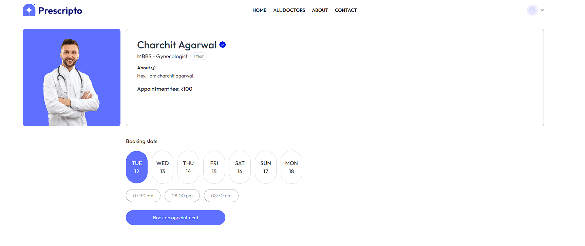

# Prescripto 🩺

Prescripto is a full-stack doctor appointment booking platform with **user authentication**, **doctor management**, **appointment scheduling**, and **payment integration**. It includes separate **User** and **Admin** panels, enabling smooth healthcare service management.

---

## 🚀 Features

### 👤 User Features
- User registration & authentication (JWT-based)
- Profile management with **Cloudinary** image upload
- Browse and search doctors
- Book and cancel appointments
- Online payments with **Razorpay** & **Stripe**

### 🛠 Admin Features
- Admin authentication
- Add, edit, and remove doctors
- View and manage all appointments
- Manage payments
- Monitor platform activity

---

## 📸 Screenshots

### **Home**


### **Book Appointment**


### **All Doctors**


## 🛠 Tech Stack

- **Frontend:** [HTML](https://developer.mozilla.org/en-US/docs/Web/HTML), [CSS](https://developer.mozilla.org/en-US/docs/Web/CSS), [Tailwind CSS](https://tailwindcss.com/), [React.js](https://react.dev/)  
- **Backend:** [Node.js](https://nodejs.org/), [Express.js](https://expressjs.com/)  
- **Database:** [MongoDB](https://www.mongodb.com/), [Mongoose](https://mongoosejs.com/)  
- **Authentication & Security:** [JWT](https://jwt.io/), [Bcrypt](https://github.com/kelektiv/node.bcrypt.js/)


## ⚙️ Installation & Setup

Clone the repository and install dependencies for both frontend and backend.

```bash
# Clone the repository
git clone https://github.com/himanshup18/Prescripto.git
cd Prescripto

# Install frontend dependencies
cd frontend
npm install

# Install backend dependencies
cd ../backend
npm install

🔑 Environment Variables
Create a .env file in both the frontend and backend directories.

#Backend .env

CLOUDINARY_NAME=xxxxxx
CLOUDINARY_API_KEY=xxxxx
CLOUDINARY_SECRET_KEY=xxxx

MONGODB_URI=xxxx
PORT=xxxx

ADMIN_EMAIL=xxxxx
ADMIN_PASSWORD=xxxxx

JWT_SECRET= xxxxx


# STRIPE_API_KEY=xxxxx
STRIPE_SECRET_KEY=xxxxxx
RAZORPAY_KEY_ID=xxxxx
RAZORPAY_KEY_SECRET=xxxx
CURRENCY=xxx

#Frontend .env

VITE_BACKEND_URL=xxxxx
VITE_RAZORPAY_KEY_ID=xxxxx

